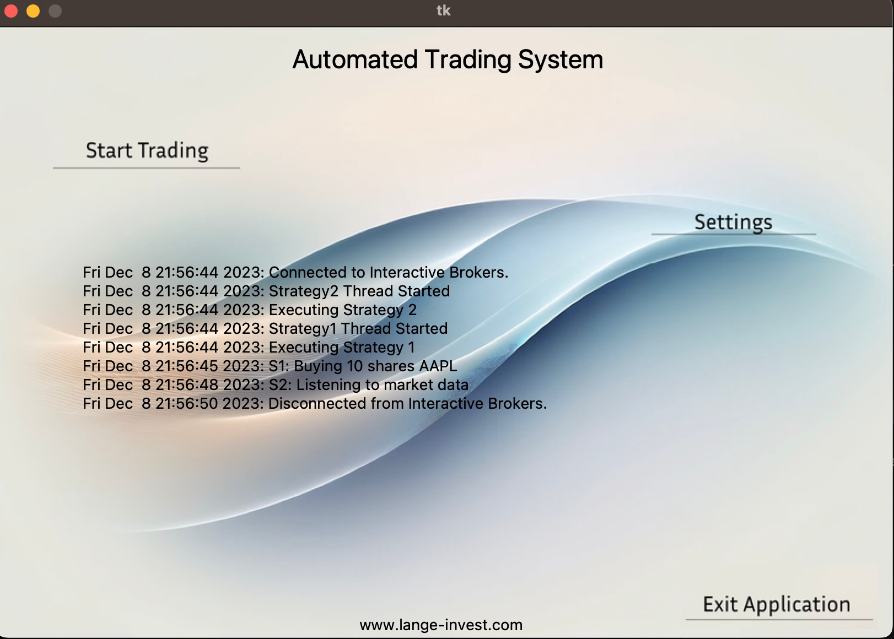

# IB-Multi-Strategy-ATS

An Automated Trading System (ATS) for managing and executing multiple trading strategies via Interactive Brokers (IB). This ATS leverages ib_insync for efficient and easy trading with IB, and uses ArcticDB for robust and scalable storage of strategy cash flow and P&L data.

#### Features

- Multiple Strategy Management: Seamlessly run multiple trading strategies simultaneously.
- Interactive Brokers Integration: Utilize ib_insync for an intuitive and powerful connection with IB's trading capabilities.
- ArcticDB for Data Storage: Track and analyze cash flow and P&L data for each strategy, ensuring accurate account management and strategy evaluation.
- User-Friendly GUI: Easy-to-use graphical interface for managing settings, strategies, and real-time monitoring.
- Customizable Strategy Parameters: Fine-tune strategies with user-defined parameters for tailored trading execution.

#### Project Structure

The ATS project is organized into several modules:

main.py: The entry point of the application.
broker/: Contains functionality for interacting with Interactive Brokers, including connection and trading utilities.
gui/: Houses the graphical user interface components, including the main application window, utility functions, and logging mechanisms.
strategy_manager/: Manages trading strategies, dynamically loading and running them based on user interaction.

#### Key Components
Broker: Handles the connection to the Interactive Brokers API, providing methods for executing trades and retrieving account information.
GUI: Provides a user-friendly interface for interacting with the ATS, including starting/stopping strategies and displaying logs.
Strategy Manager: Dynamically loads and manages multiple trading strategies, allowing them to run simultaneously and independently.
Strategies
strategy1.py, strategy2.py, etc.: These files define individual trading strategies. Each strategy is encapsulated in a Strategy class with methods for executing the strategy's logic.

#### Getting Started

To run the ATS, ensure you have Python installed on your system and follow these steps:

Clone the repository to your local machine.
Install any required dependencies (e.g., ib_insync for Interactive Brokers integration).
Navigate to the project root directory and run python main.py.
Usage

Upon launching the ATS, the GUI will present options to connect to Interactive Brokers, start/stop trading strategies, and view real-time logs. The strategies can be managed through the interface, allowing for flexible trading operations.

GUI Controls
Start Trading: Initializes the connection to IB and starts the selected trading strategies.
Stop Trading: Gracefully stops all running strategies and disconnects from IB.
Settings: Access settings for customizing the ATS behavior.
Exit: Closes the ATS application.
Customization

To add new strategies:

Create a new Python file in the strategy_manager/strategies/ directory.
Define a Strategy class with run and stop methods.
The ATS will automatically detect and load the new strategy.
